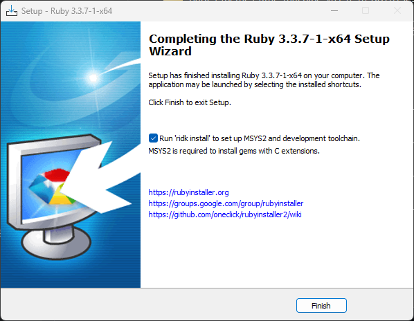
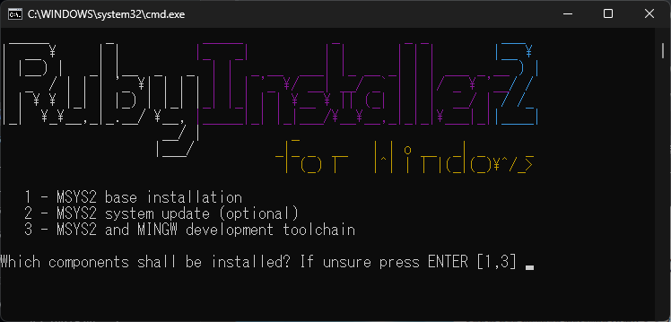

---
title: Jekyll
tags:
  - Web
  - Jekyll
  - Ruby
updated_at: ''
id: e3ae5516-8075-4dd0-b368-8819db6ff114
---

## Jekyllとは
`Jekyll`は`Ruby`で開発されている静的サイトジェネレータ．
データベースを必要とせず、WordPressのようなコンテンツ管理システムを使用することなく、個人ブログ、ポートフォリオサイト、ドキュメントサイトなど、様々なタイプの静的サイトを構築することが可能．

`GitHub`の共同創業者であるTom Preston-Wernerによって開発され，MITライセンスで配布されたいる．

## Jekyllの導入
`Jekyll`を利用するには，先に`Ruby`をインストールしておく必要がある.
公式サイトの[ドキュメント](https://jekyllrb.com/docs/installation/#requirements)にしたがってWindowsに導入する．

> **Requirements**
> - `Ruby` version 2.7.0 or higher, including all development headers (check your Ruby version using ruby -v)
> - `RubyGems` (check your Gems version using gem -v)
> - `GCC` and `Make` (check versions using gcc -v,g++ -v, and make -v)

#### 
Windowsに`Ruby`をインストールするため，[`RubyInstaller`](https://rubyinstaller.org/)を使用する．
[RubyInstaller Downloads](https://rubyinstaller.org/downloads/)から`Ruby+Devkit`版をダウンロードして，インストール．






## JekyllのCLIコマンド

- `jekyll build`：_siteディレクトリに静的なサイトを生成する
- `jekyll serve`：サイトを構築し、ローカルマシンでウェブサーバーを起動することで、http://localhost:4000を使いブラウザでサイトをプレビューすることが可能になる
- `jekyll new [site name]`：指定されたサイト名で新しいディレクトリに新しいJekyllサイトを作成する
- `jekyll doctor`：設定や依存関係の問題があれば出力する
- `jekyll clean`：生成されたサイトファイルが格納されている_siteディレクトリを削除する
- `jekyll help`：Jekyllのヘルプドキュメントを出力する
- `jekyll serve` --draft：_draftsディレクトリにあるすべての投稿を含めJekyllサイトを生成

詳細は[ドキュメント](https://jekyllrb.com/docs/usage/)を確認

## Jekyllの設定ファイル
サイト全体の設定は`_config.yml`という名前のYAMLファイルに記述する．
一般的な設定オプションを以下に示す．

- `title` : サイトのタイトル
- `description` : サイトの短い説明
- `url` : サイトのベースURL
- `baseurl` : （サブディレクトリでホストする場合）サイトのサブディレクトリ
- `permalink` : 投稿とページのURL構造
- `exclude` : サイト生成プロセスから除外するファイルまたはディレクトリの一覧
- `include` : サイト生成プロセスに含めるファイルまたはディレクトリの一覧
- `paginate` : ページネーション使用時に1ページに表示する投稿の数
- `plugins` : 読み込むJekyllプラグインの一覧
  - デフォルトで`minima`に設定される
  - 各種設定を行うことで，任意の他のテーマを使用することができる


## その他
デフォルトでは、Jekyllでは以下に当てはまるファイルやフォルダをビルドしない．

- /node_modules または /vendor フォルダーに配置されている
- `_`、`.`、または`#`で始まる
- `~` で終わる
- 構成ファイルの exclude 設定によって除外される

これらのファイルの中に Jekyll で処理したいものがある場合、構成ファイルの include 設定を利用できる．

## YAML front matter

```
---
layout: post
title: Blogging Like a Hacker
---
```

[](https://jekyllrb.com/docs/front-matter/)


## テーマ


## 


## 参考資料

- [_: Jekyllで静的サイトを構築する方法](https://kinsta.com/jp/blog/jekyll-static-site/)
- []()
- []()

