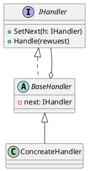

**Chain of Responsibility（責任の連鎖）** は、 振る舞いに関するデザインパターンの一つで、 ハンドラーの連鎖に沿ってリクエストを渡すことができる． 各ハンドラーは、 リクエストを受け取ると、 リクエストを処理するか、 連鎖内の次のハンドラーに渡すかを決める．

<!-- more -->

## 構造

- `IHandler`
  - すべての具象ハンドラに共通するインタフェース．
  - 通常はリクエストを処理するためのメソッドやのみを含む

- `BaseHandler`
  - 子要素を持たないツリー要素．

- `Concreate Handler`
  - リクエストを処理するための実コードをもつ．
  - 自身で処理出来ない場合は，連鎖に沿ってリクエストを次のハンドラへ委譲する．

## 適用例
`Chain of Responsibility`パターンは、フィルターやイベント・チェーンのようなオブジェクトの連鎖を対象に動作するコードを書く時に用いられる．

## 参考資料
- [Guru: Chain of Responsibility](https://refactoring.guru/ja/design-patterns/chain-of-responsibility)
- 
- 