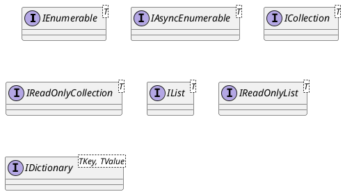

<!-- more -->

```puml
@startuml

' Enumerable
interface IEnumerable<T> {}
interface IAsyncEnumerable<T> {}

' Collection
interface ICollection<T> {}
interface IReadOnlyCollection<T> {}

' List
interface IList<T> {}
interface IReadOnlyList<T> {}

' Dictionary
interface IDictionary<TKey, TValue> {}

@enduml
```

## 参考資料
- 
- 